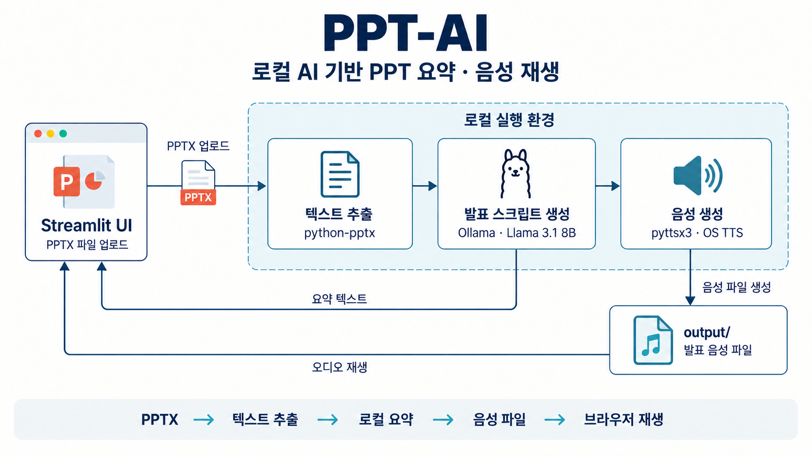

# PPT-AI

PowerPoint 파일의 텍스트를 추출해 로컬 LLM으로 발표용 요약을 만들고, TTS로 읽어주는 Python 실험 프로젝트입니다. 텍스트 추출 스크립트부터 요약·음성 출력·Streamlit 업로드 화면까지 단계별 구현을 보관합니다.

## 처리 흐름

`PPTX 업로드 → 슬라이드·표 텍스트 추출 → Ollama 요약 → 화면 표시 → TTS 파일 생성·재생`

[app.py](./app.py)는 Streamlit 화면에서 PPTX를 받아 위 과정을 실행합니다. 요약 모델은 `llama3.1:8b`이며, 음성은 pyttsx3와 운영체제의 음성 엔진을 사용합니다.

## 아키텍처

아래 구성은 업로드 화면인 [app.py](./app.py)를 기준으로 합니다. 브라우저 UI와 Python 앱, 로컬 모델 서버, 음성 엔진의 역할을 구분했습니다.



요약 요청은 코드에 지정된 로컬 Ollama 서버로 전달합니다. 음성 파일의 .mp3 확장자와 실제 인코딩 일치 여부는 실행 환경에서 확인해야 합니다.

## 파일 구성

| 파일 | 역할 |
| --- | --- |
| [main.py](./main.py) | 슬라이드·표·발표자 노트 텍스트 추출 및 TXT 저장 |
| [main01.py](./main01.py) | Ollama 요약과 원문·요약 TXT 저장 |
| [main02.py](./main02.py) | 발표 스크립트 프롬프트와 요약 후처리 실험 |
| [main03.py](./main03.py), [main04.py](./main04.py) | 프롬프트 변형과 pyttsx3 음성 출력 |
| [app.py](./app.py) | PPTX 업로드, 요약 표시, 음성 파일 재생 UI |

`data/`, `output/`, `venv/`, `.env`는 .gitignore에 포함되어 있습니다. 예제 PPT와 생성 결과는 저장소에 포함되지 않습니다.

## 실행 방법

Python, [Ollama](https://ollama.com/), 운영체제의 TTS 엔진을 준비합니다. 현재 저장소에는 버전을 고정한 requirements.txt가 없으며, 아래 목록은 코드의 import를 기준으로 정리했습니다.

### 1. Python 패키지 설치

Windows PowerShell 기준입니다.

```powershell
python -m venv venv
.\venv\Scripts\python.exe -m pip install streamlit python-pptx requests pyttsx3
```

### 2. 모델 준비 및 서버 주소 확인

```powershell
ollama pull llama3.1:8b
```

현재 코드의 `OLLAMA_API_URL`은 `http://localhost:11435/api/chat`입니다. Ollama의 기본 포트는 11434이므로, 기본 설정으로 실행한다면 사용할 스크립트의 주소를 `http://localhost:11434/api/chat`으로 변경해야 합니다. 기존 주소를 사용하려면 서버의 `OLLAMA_HOST`를 127.0.0.1:11435로 설정하고 재시작합니다. [Ollama 설정 안내](https://docs.ollama.com/faq)

### 3. 업로드 화면 실행

```powershell
.\venv\Scripts\python.exe -m streamlit run app.py
```

브라우저에서 터미널에 표시된 주소를 열고 PPTX를 업로드합니다. 요약이 표시되면 음성 파일을 `output/`에 저장하고 재생합니다.

명령줄 예제를 실행하려면 해당 파일의 `PPT_FILE_PATH`를 준비한 PPTX 경로로 바꾼 뒤 실행합니다.

```powershell
.\venv\Scripts\python.exe main.py
```

## 구현 범위와 한계

- PPT를 새로 만드는 도구가 아니라 기존 PPTX의 텍스트를 요약하는 도구입니다.
- app.py는 슬라이드의 텍스트와 표를 읽습니다. 발표자 노트 추출은 main.py에 있으며, 이미지 OCR이나 차트·레이아웃 해석은 구현하지 않았습니다.
- 모든 슬라이드 텍스트를 한 요청에 넣습니다. 긴 문서를 나눠 처리하거나 요약 정확도를 자동 평가하는 기능은 없습니다.
- app.py는 음성 파일을 .mp3 이름으로 저장하지만 실제 인코딩과 재생 가능 여부는 TTS 백엔드에 따라 확인이 필요합니다. 한국어 음질도 설치된 음성 엔진에 영향을 받습니다.
- 처리 시간 표시는 요약까지의 시간이며 TTS 생성 시간은 포함하지 않습니다.
- 로컬 모델 다운로드와 실행 환경이 필요합니다. 이번 README 정리는 코드를 기준으로 작성했으며 모델 추론·음성 재생을 다시 검증한 결과는 아닙니다.

## 사용 기술

Python · python-pptx · Ollama · Llama 3.1 · requests · pyttsx3 · Streamlit
